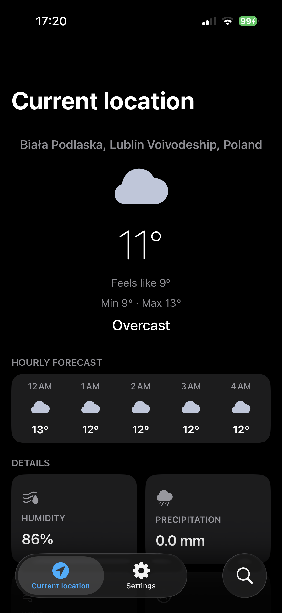
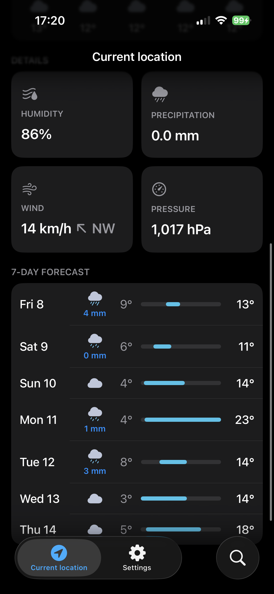
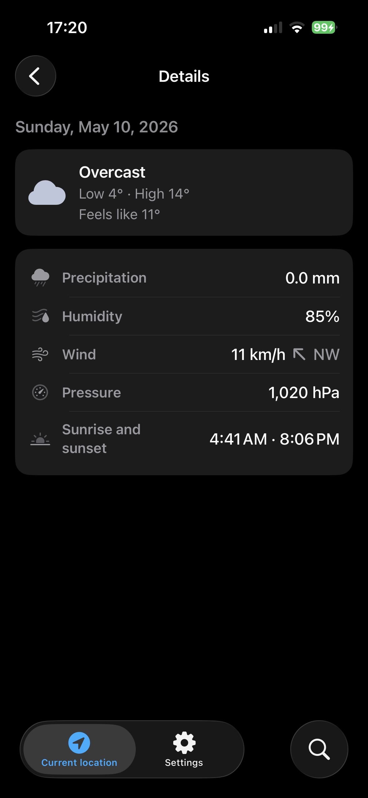

# WeatherApp

Native weather client built with **SwiftUI**. It shows conditions and a short forecast for where you are or for places you search.

- **Forecasts + city search**: **Open-Meteo** (no API key required)
- **GPS**: **Core Location**
- **Reverse geocoding (current location display name)**: **OpenStreetMap Nominatim** (no API key; language requested via `accept-language`)

## Screenshots

  
  
  

## Features

- **Current location** tab — refreshes from the device coordinate and resolves a readable place name  
- **Search** — find a city and open the same forecast-style experience (search results use your app language when available)  
- **Settings** — temperature units (metric / imperial) and optional locale override  
- **Seven-day outlook** with hourly detail where the UI supports it, plus essentials like wind, humidity, and pressure mapped from WMO weather codes  
- Short **splash** on launch; light accessibility-minded copy via shared localization helpers  

## Requirements

- **Xcode** with an SDK for **iOS 26.2** (see `IPHONEOS_DEPLOYMENT_TARGET` in `WeatherApp.xcodeproj` — bump there if your toolchain differs)  
- A device or simulator with **location** enabled if you want the “here” tab to do something meaningful  

## Running

1. Open `WeatherApp.xcodeproj` in Xcode.  
2. Select a simulator or device and run the **WeatherApp** scheme.  
3. Grant location permission when prompted if you’re testing the current-location flow.  

No extra secrets or plist keys are required.

## Privacy & permissions

The app requests **location when in use** for the current-location tab. The usage string is set in the target as `NSLocationWhenInUseUsageDescription` (“Used to show weather for where you are.”).

## Project layout

The code is split in a familiar layered style:

| Area | Role |
|------|------|
| `Domain/` | Entities, repository protocols, use cases, location/place abstractions |
| `Data/` | Open-Meteo DTOs/mappers, Nominatim reverse geocoding (no-key), `URLSession`-based HTTP client, reachability, Core Location location provider |
| `Presentation/` | SwiftUI views, view models, tab shell, settings, shared formatting and UI bits |
| `App/` | Composition root (`WeatherDependencies`) wiring concrete types |

The app entry point is `WeatherAppApp`, which builds dependencies and hosts `RootView` → `MainTabView`.

## Data & attribution

Forecast and city search geocoding data come from **[Open-Meteo](https://open-meteo.com/)**.

Current-location reverse geocoding uses **[OpenStreetMap Nominatim](https://nominatim.org/)**. If you ship or redistribute a derived product, review provider usage policies (rate limits and attribution) and comply accordingly.

## License

No license file is included in this repository; treat usage as unspecified unless you add one.
